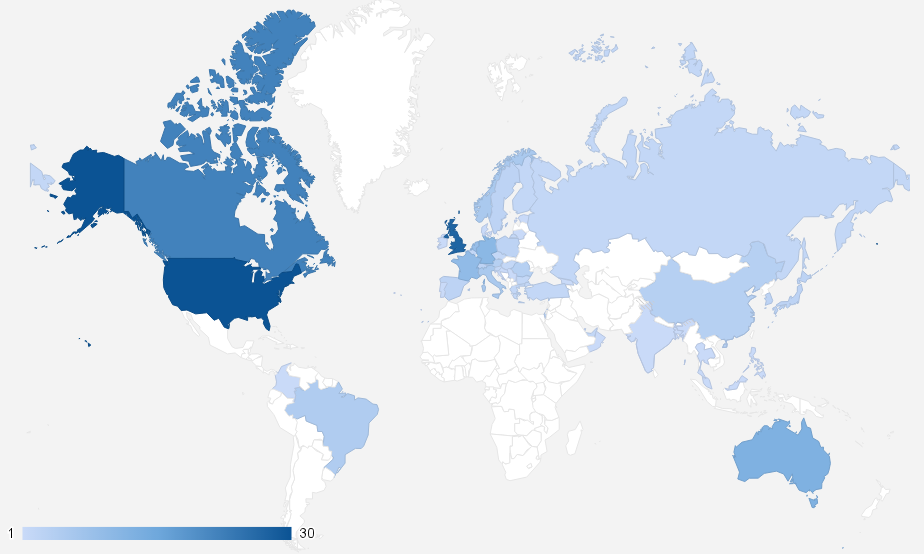

# 以太坊调研报告

* [1. 以太坊基本信息](#1.以太坊基本信息)
* [2. 以太坊架构设计](#2.以太坊架构设计)
* [3. 以太坊dapp开发工具](#3.以太坊dapp开发工具)
* [4. 以太坊dapp](#4.以太坊dapp)
* [5. 总结](#5.总结)
* [6. 参考链接](#6.参考链接)

## 以太坊基本信息

项目git仓库地址: https://github.com/ethereum/go-ethereum
官方实现以太坊协议实现语言: golang
共识算法:
性能:
治理模型:
Star人数: 20710
Fork人数: 7094
contributors人数: 330
releases版本数:139
支持的客户端: go语言实现的Mist客户端，C++语言实现的Alethzero客户端, Python语言开发的Pythereum，Nodejs开发的Node-Ethereum，Java语言开发的Ethereumj
智能合约开发语言: solidity
以下结果来自以太坊社区调查报告:
全球开发者分布:

北美洲占43%，欧洲占40%，亚洲占10%，大洋洲占5%，南美洲占2%
以太坊社区透明度:良好
以太坊财务透明度:良好
以太坊在社会中的实际应用是否明确:较为明确
以太坊开发进度:以太坊开发者会及时公布开发进度（通过写博客或者交流的方式）

## 以太坊架构设计
以太坊架构设计图：

## 以太坊dapp开发工具
以太坊开发工具
* Mist Mist的功能包括保存以太币、发送交易、部署合约等。你可以用它实现与区块链平台或测试网络
的交互。当你需要进行快速交易时超级有用
* Geth Geth除了实现Mist的全部功能，还包含一些额外的重要特性，例如提供RPC API接口给应用程序以便你的应用可以通过它连接如以太坊网络。
* Parity Parity是一个用Rust开发的以太坊节点软件，开发者是前以太坊CTO：Gavin Wood博士。Parity 的特点就是速度块、轻量化。Parity 还在本机的8080 端口提供了一个Web界面供你访问。
* MetaMask Chrome浏览器插件可以极大简化对你的DApp（去中心化应用：Decentralized Application）的访问
* Web3.js  Web3.js是web应用和区块链交互的桥梁
* Truffle 提供了快速创建、编译、部署和测试区块链应用的构建模块
* Solc 是以太坊智能合约编译器，可以把合约代码编译成以太坊字节码
* Solium solidity代码静态分析器，可以帮助开发者规范代码并发现安全隐患
* ether.camp 微软提供的在线全功能solidity集成开发环境
* BlockApps BlockApps提供了一些简洁的API来帮助你查看钱包余额、编写交易、读取合约状态等
* Embark Embark是另一个流行的开发框架，帮你轻松地构建、测试和部署DApp
* Zeppelin Zeppelin库用来编写安全的合约
### truffle
Truffle是一个世界级的开发环境，测试框架，以太坊的资源管理通道，致力于让以太坊上的开发变得简单，Truffle有以下：
* 内置的智能合约编译，链接，部署和二进制文件的管理
* 快速开发下的自动合约测试
* 脚本化的，可扩展的部署与发布框架
* 部署到不同的公网或私网的网络环境管理功能
* 使用EthPM&NPM提供的包管理，使用ERC190标准
* 与合约直接通信的直接交互控制台（写完合约就可以命令行里验证了）
* 可配的构建流程，支持紧密集成

### truffle客户端
适用于开发的客户端:
* EtherumJS TestRPC 当开发基于Truffle的应用时，我们推荐使用EthereumJS TestRPC。它是一个完整的在内存中的区块链仅仅存在于你开发的设备上。它在执行交易时是实时返回，而不等待默认的出块时间，这样你可以快速验证你新写的代码，当出现错误时，也能即时反馈给你。它同时还是一个支持自动化测试的功能强大的客户端。Truffle充分利用它的特性，能将测试运行时间提速近90%。

适用于正式发布的客户端:
* Geth (go-ethereum)
* WebThree(cpp-ethereum)
#### ganache-cli
Ganache是一个运行在个人桌面上的以太坊开发者的个人区块链。Ganache是Truffle Suite的一部分，通过把合约和交易放到前面来简化dapp的开发。通过使用Ganache，你可以快速的看到你的应用是如何影响区块链的。其中细节：如你的账户、余额、合约及Gas成本。你也可以调整Ganache的采矿控制来更好的适用你的应用。
#### unbox
Truffle 的盒子Boxs装有很多非常实用的项目样板，可以让你忽略一些环境配置问题，从而可以集中与开发你自己的DApp的业务唯一性。除此之外，Truffle Boxes能够容纳其他有用的组件、Solidity合约或者库，前后端视图等等。所有这些都是一个完整的实例Dapp程序。都可以下载下来逐一研究，寻找适合自己公司目前业务模型的组件。

### Embark
Embark 让开发者开发和部署以太坊dapp更容易，Embark当前集成了EVM区块链、去中心化存储IPFS、去中心化通信平台（Whisper和Orbit），支持swarm部署。
Embark框架链接 https://github.com/embark-framework/embark
Embark框架特点
区块链（Ethereum）:
* 自动化的部署合约，方便js代码中调用。Embark可以自动监听合约的变化并重新部署变化后的合约。
* 合约可以通过js的promise调用
* 使用Javascript使用合约进行测试驱动开发。
* 追踪已经部署的合约，当合约更新的时候，会自动更新
* 管理不同链(testnet、private net,livenet)
* 轻松管理相互依赖合同的复杂系统

去中心化存储（IPFS）:
* 通过EmbarkJS轻松存储和检索DApp上的数据。 包括上传和检索文件。
* 将完整的应用程序部署到IPFS或Swarm。
去中心化通信（Whisper, Orbit）:
* 通过Whisper或Orbit轻松通过P2P渠道发送/接收消息。
web 技术:
* 与任何网络技术集成，包括React，Foundation等。
* 使用您想要的任何构建管道或工具，包括grunt，gulp和webpack。

## 以太坊dapp

dapp总数: 775，游戏类411,占比54%，竞猜类共152个，占比20%，交易市场占比4%，其他占比22%
累计交易笔数: 3亿
累计交易金额: 59亿ETH
用户数: 3587万人
日均活跃人数: 20万人

游戏类: 以太小精灵，加密猫，
交易市场类: IDEX,Delta,Bancor,PoWH 3D
竞猜类: Fomo3D，FairDapp, Zethr
其他: Kyber,Ox协议，Livepeer,以太坊域名服务

## 总结

参考：
https://github.com/ethereum
http://www.wanbizu.com/xinbi/201503284872.html
https://www.jianshu.com/p/53fcdd255ef7
