# punica-ts测试
## 问题1
文档中没有说明安装punica-ts 对npm版本的要求

## 问题2
文档中没有说明源码编译安装的操作步骤

##问题3
文档中没有说明安装失败的解决方案

##问题4
punica invoke 没有list子命令

##问题5
punica invoke --function functionName 执行成功
punica-ts invoke --function functionName 执行失败

失败截图：
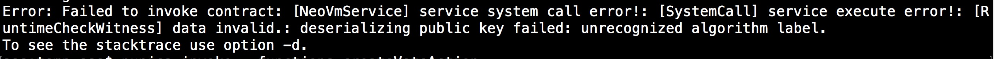
default-config配置截图
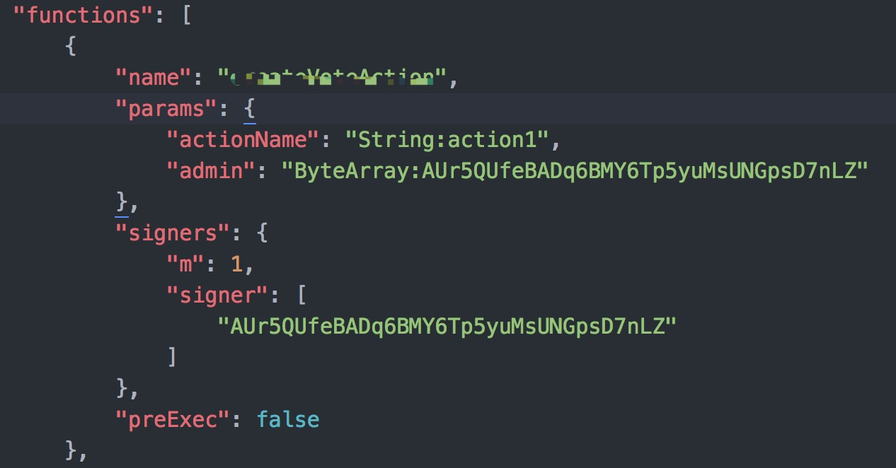

##问题6
asset transfer 交易 只打出了交易hash 没说明交易是否成功
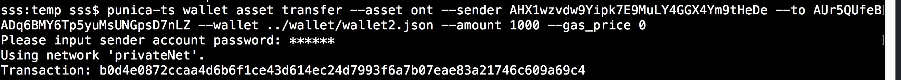

## 问题7
punica-ts wallet asset withdrawOng
必须指定钱包文件
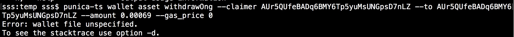

## 问题8
punica-ts wallet ontid delete
提示信息有误
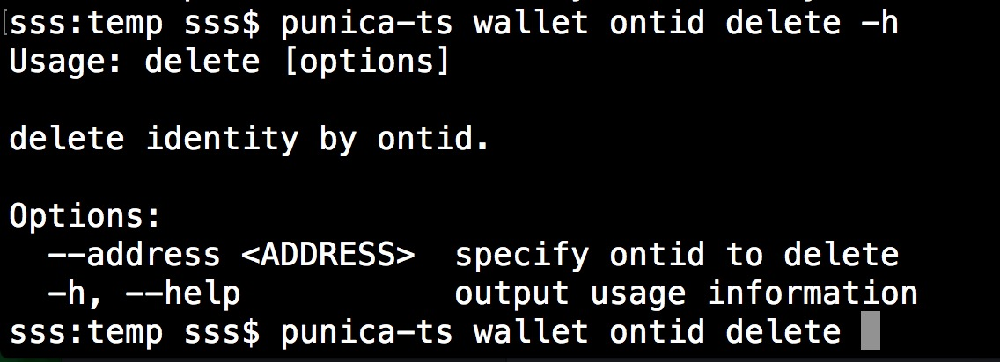
执行报错
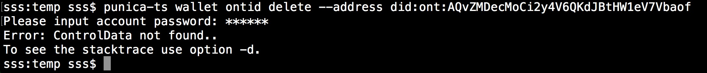

## 问题9
punica-ts unbox
提示信息有误
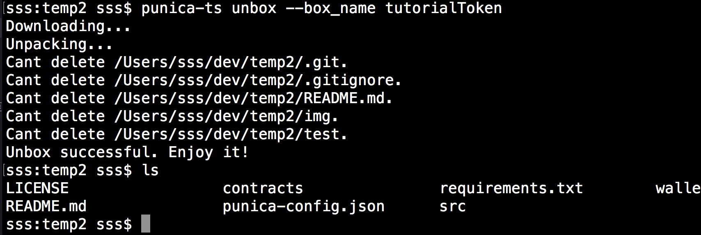

## 问题10
提示信息有误
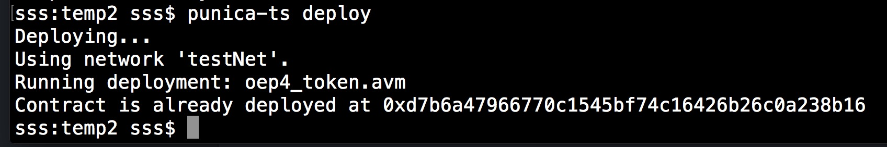

# punica-ts wallet account 测试结果

## punica-ts asset

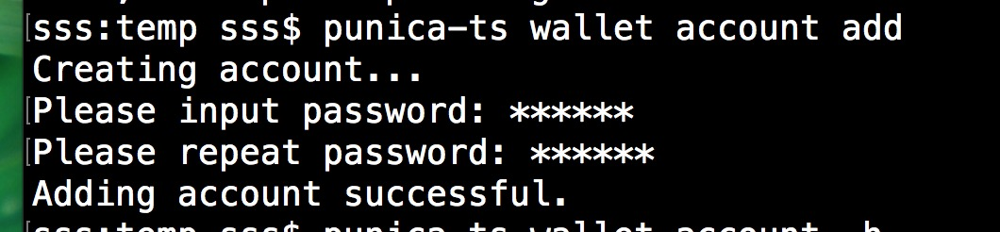

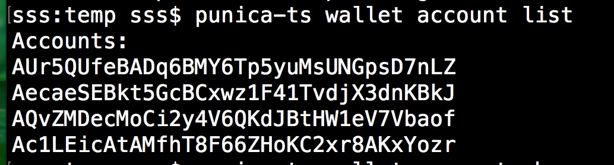

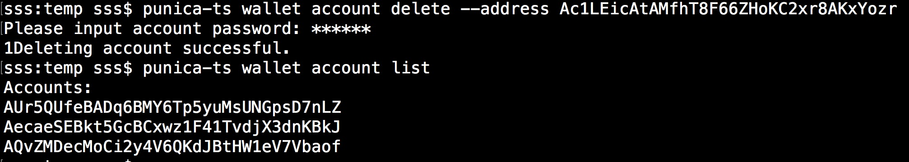

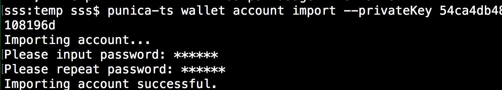

## punica-ts wallet asset
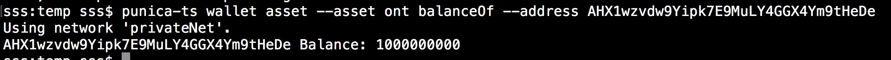
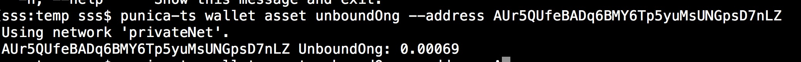

## punica-ts wallet ontid

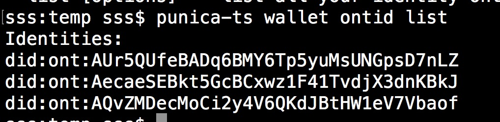

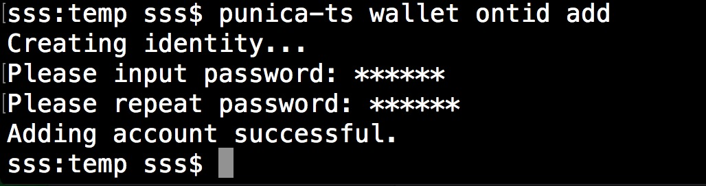

## punica-ts init

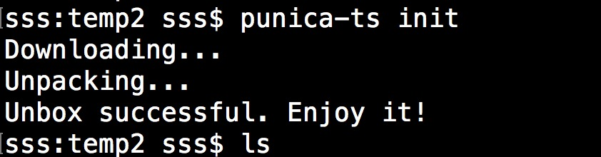

## punica-ts unbox --box_name tutorialToken

## punica-ts compile

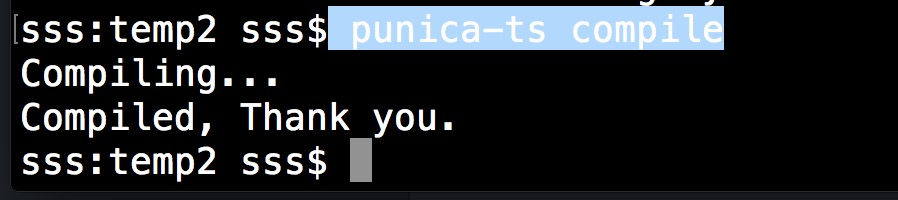

## punica-ts compile

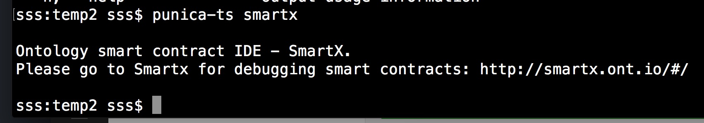
